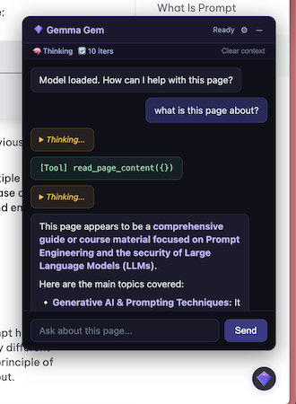

# Gemma Gem

Your personal AI assistant living right inside the browser. Gemma Gem runs Google's Gemma 4 model entirely on-device via WebGPU — no API keys, no cloud, no data leaving your machine. It can read pages, click buttons, fill forms, run JavaScript, and answer questions about any site you visit.

## Requirements

- Chrome with WebGPU support
- ~500MB disk for E2B model, ~1.5GB for E4B (cached after first run)

## Setup

```bash
pnpm install
pnpm build
```

Load the extension in `chrome://extensions` (developer mode) from `.output/chrome-mv3-dev/`.

## Usage

1. Navigate to any page
2. Click the gem icon (bottom-right corner) to open the chat
3. Wait for model to load (progress shown on icon + chat)
4. Ask questions about the page or request actions

## Architecture

```
Offscreen Document          Service Worker           Content Script
(Gemma 4 + Agent Loop)  <-> (Message Router)    <-> (Chat UI + DOM Tools)
       |                         |
  WebGPU inference          Screenshot capture
  Token streaming           JS execution
```

- **Offscreen document**: Hosts the model via `@huggingface/transformers` + WebGPU. Runs the agent loop.
- **Service worker**: Routes messages between content scripts and offscreen document. Handles `take_screenshot` and `run_javascript`.
- **Content script**: Injects gem icon + shadow DOM chat overlay. Executes DOM tools (`read_page_content`, `click_element`, `type_text`, `scroll_page`).

## Tools

| Tool | Description | Runs in |
|------|-------------|---------|
| `read_page_content` | Read text/HTML of the page or a CSS selector | Content script |
| `take_screenshot` | Capture visible page as PNG | Service worker |
| `click_element` | Click an element by CSS selector | Content script |
| `type_text` | Type into an input by CSS selector | Content script |
| `scroll_page` | Scroll up/down by pixel amount | Content script |
| `run_javascript` | Execute JS in the page context with full DOM access | Service worker |

## Settings

Click the gear icon in the chat header:

- **Model**: Switch between Gemma 4 E2B (~500MB), E4B (~1.5GB), or **LM Studio (local)** — a model served by a local OpenAI-compatible endpoint over a link (see below). Selection persists across sessions.
- **Thinking**: Toggle native Gemma 4 thinking
- **Max iterations**: Cap on tool call loops per request
- **Shortcuts**: Rebind the keyboard shortcuts that toggle and close the chat. Click a shortcut field, press the key combination you want, and it's saved. The `↺` button resets a shortcut to its default. Defaults: **Alt+G** toggles the chat, **Escape** closes it. Bindings persist across sessions.
- **Clear context**: Reset conversation history for the current page
- **Hide gem icon (this session)**: Temporarily hide the floating icon for the current site. It stays hidden across page reloads but reappears after a browser restart. While hidden, reopen the chat with the toggle shortcut (default **Alt+G**), then click **Show gem icon** to bring it back.
- **Disable on this site**: Disable the extension per-hostname (persisted)

The floating gem icon is also **draggable** — press and drag it anywhere on the page. Its position is remembered across pages and sessions. A quick click still opens the chat; only a real drag moves it.

The chat window opens **anchored to the icon** and is itself **movable** — drag it by its header (the title bar). The icon and window stay linked: moving either one moves the other, so the whole assistant travels together. The position is remembered across pages and sessions.

## Using a local model via LM Studio (link)

Instead of running Gemma in-browser via WebGPU, you can point Gemma Gem at a local
OpenAI-compatible server such as [LM Studio](https://lmstudio.ai). This offloads
inference to the LM Studio process (which can use larger models / different
hardware) while keeping everything on your machine.

1. In LM Studio, download and load a model. A **Gemma** model is recommended —
   the agent uses Gemma's chat + tool-call format, so tool use works best with a
   Gemma model. (Plain chat works with any model.)
2. Open the **Developer** tab and **Start Server** (default `http://localhost:1234`).
3. In Gemma Gem's gear-icon settings, set **Model** to **LM Studio (local)**. A small
   panel appears:
   - **Endpoint URL** — the server base URL ending in `/v1` (default `http://localhost:1234/v1`).
   - **Model name** — optional; leave blank to use LM Studio's currently-loaded model.
   - **API key** — optional; only needed for endpoints that require a bearer token.
   - **Context limit** — token budget used for history management (match your model's context).

The settings persist across sessions. Switching back to a Gemma WebGPU model is one
dropdown change away. Note: image/audio tools (screenshots) are only supported on the
in-browser WebGPU backend, not over the LM Studio link.

## Keyboard Shortcuts

| Shortcut | Action | Default |
|----------|--------|---------|
| Toggle chat | Open/close the chat overlay from anywhere on the page | `Alt+G` |
| Close chat | Close the overlay when it's open | `Escape` |

Both are rebindable from the gear-icon settings panel (see **Shortcuts** above).

## Development

```bash
pnpm build              # Development build (with logging, source maps)
pnpm build:prod         # Production build (logging silenced, minified)
```

## Tech Stack

- [WXT](https://wxt.dev) — Chrome extension framework (Vite-based)
- [@huggingface/transformers](https://github.com/huggingface/transformers.js) — Browser ML inference
- [marked](https://github.com/markedjs/marked) — Markdown rendering in chat
- Gemma 4 E2B / E4B (`onnx-community/gemma-4-E2B-it-ONNX`, `onnx-community/gemma-4-E4B-it-ONNX`) — q4f16 quantization, 128K context

## Debugging

All logs are prefixed with `[Gemma Gem]`. In development builds, info/debug/warn logs are active. Production builds only log errors.

- **Service worker logs**: `chrome://extensions` → Gemma Gem → "Inspect views: service worker"
- **Offscreen document logs**: `chrome://extensions` → Gemma Gem → "Inspect views: offscreen.html"
- **Content script logs**: Open DevTools on any page → Console
- **All extension pages**: `chrome://inspect#other` lists all inspectable extension contexts (service worker, offscreen document, etc.)

The offscreen document logs are the most useful — they show model loading, prompt construction, token counts, raw model output, and tool execution.

## Hardware Requirements (WebGPU)

> Estimated minimal requirements (not benchmarked on real devices)

| | E2B (~500 MB) | E4B (~1.5 GB) |
|---|---|---|
| **GPU VRAM / Shared Memory** | 4 GB | 6 GB |
| **System RAM** | 6-8 GB | 8-16 GB |
| **Browser** | Chrome 113+ / Edge 113+ with WebGPU | Same |
| **GPU Feature** | `shader-f16` required | Same |

- **Integrated GPUs**: Intel Xe (Arc), Apple M1+, Qualcomm Adreno work with sufficient shared memory
- **Discrete GPUs**: Any with 4 GB+ VRAM (e.g. GTX 1650, RX 6500 XT)
- **Mobile**: iPhone A14+, Snapdragon 8 Gen 1+ (slow)
- **Performance**: Slow on integrated GPUs, normal on mid-range discrete GPUs, fast on high-end GPUs
- At long contexts (128K), KV cache adds 10-20% memory overhead on top of model weights




